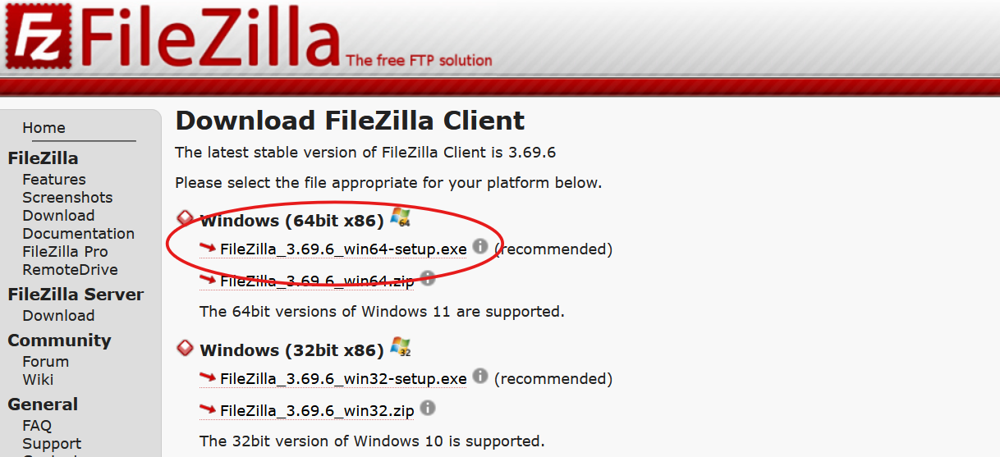
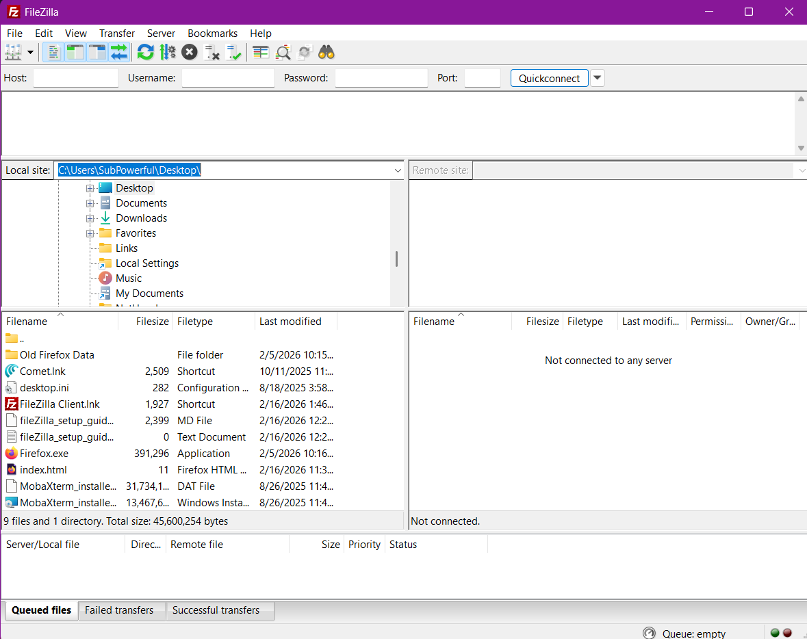
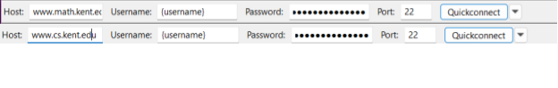
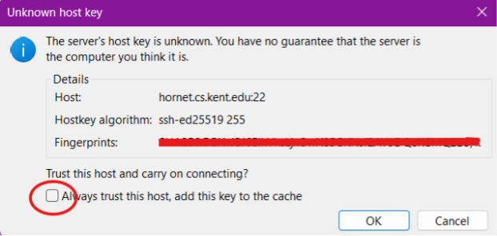
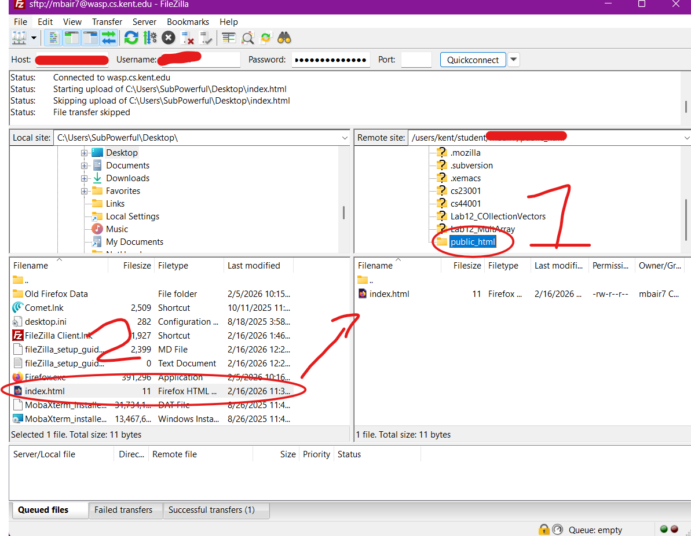

# FileZilla Setup Guide for University Faculty and Students

## Overview

This guide provides instructions for setting up the FileZilla client on a Windows machine for sending files from your personal computer to a server. Specifically, these instructions will help you move and update your website located at **cs.kent.edu/~name** or **math.kent.edu/~name**.

---

## Check for Existing Installation

The first thing you need to do is check on your computer to see if FileZilla is already pre-installed. Press the Windows key or click on the search bar and type in "FileZilla". If FileZilla is already installed, then you can skip the setup process.

---

## Setup Process

To begin, go [here](https://filezilla-project.org/download.php?show_all=1) and download the FileZilla client.

After downloading FileZilla, follow the installation instructions. Have FileZilla installed only for yourself. Make sure to select the Desktop Icon option to be able to see FileZilla on your desktop space. Then just use the default recommendations for the rest of the setup.

---

## Establishing a Connection

For connecting, first understand what server you need to connect to. If you are in Math, connect to **www.math.kent.edu**, and if you are in CS, connect to **www.cs.kent.edu**.

This is done by typing in the host (**www.math.kent.edu** or **www.cs.kent.edu**), then adding in your username (first part of your Kent email), then your password, followed by manually inputting port **22**.

Click Quickconnect and then allow your computer to trust the host.

---

## Transferring Files

Once a connection has been established, the next step is to find the HTML file on your personal computer that you want to add to the server. Then on the host, go to your **public_html** folder, double click to open it, and then drag and drop the files from your personal computer to the host machine.

---

## Important Note

Unfortunately, FileZilla only has manual sync, so you will have to connect and then drag and drop your files every time you make a change.
